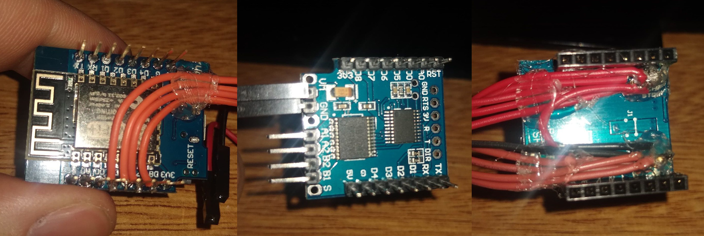
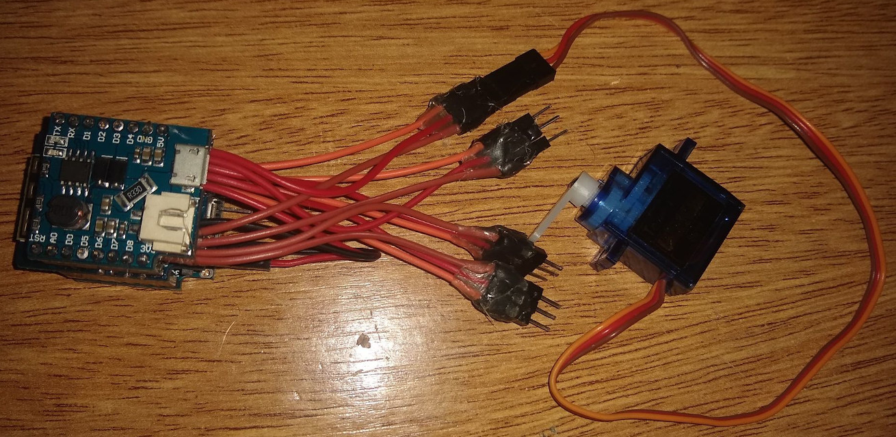
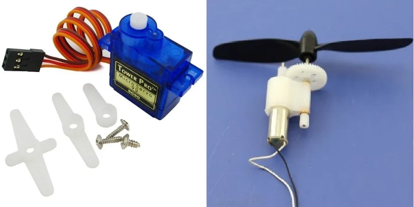
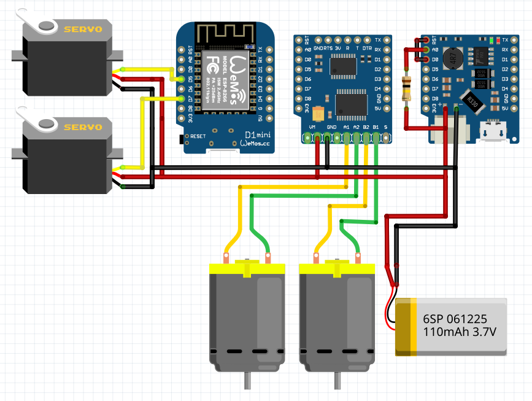
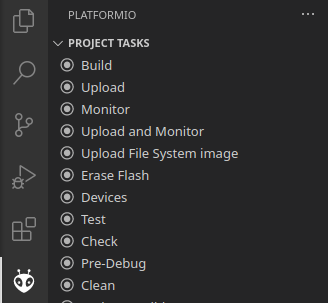
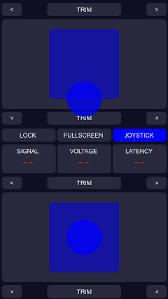
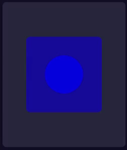
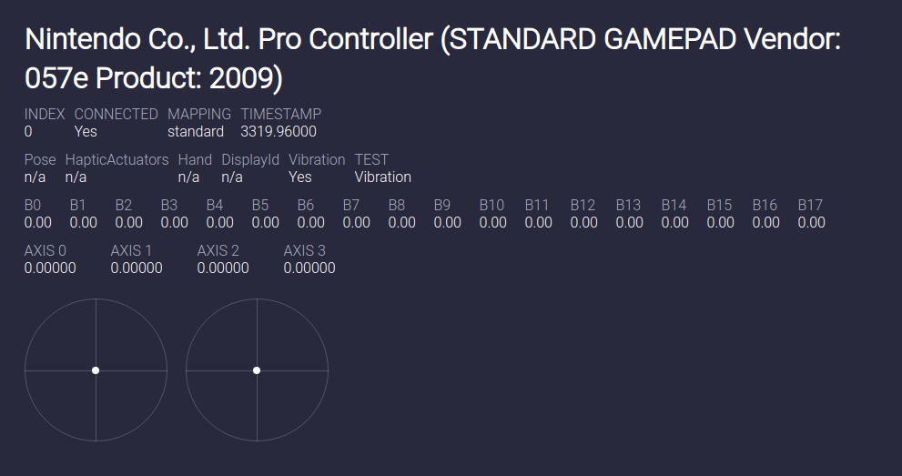

# WARNING | THIS IS A WORK IN PROGRESS! 

This proyect is a work in progress (NOT WORKING, yet)

# ESP8266 Plane

Sorry for my english, i'm learning.

## The Idea

The idea is a simple wifi plane, controlled whit a Phone using a Touch Screen or a Bluetooth Joystick

## Hardware

Controller Part List:

* Wemos D1 Mini
* Wemos Motor Shield
* Wemos Battery Shield
* 100k resitor
* 500 mAh 1c 3.7v lipo battery  
* Phone or PC 
* Bluetooth Joystick (im using a Swich Pro Controller)
* USB to USB Micro Cable (charging and upload the program)
* Cable and conectors.

Plane Part List:

* 2mm Foamboard
* 1mm Balsa wood
* 2 Small servos
* 2 Small plane motors
* 2 Rubber Bands (for the wing)
* 2 bamboo sticks or 2 brochete sticks or 4 toothpicks  
* Steel Wire

Tools list:

* Soldering Iron and lead
* Hot Glue Gun and Sticks
* Cutter
* Superglue

## Diagram

## Software

### Install Firmware to ESP8266

1. Install CH340G Serial Driver - [Windows](https://www.instructables.com/id/Instalar-driver-para-CH340G/) - [Mac](https://kig.re/2014/12/31/how-to-use-arduino-nano-mini-pro-with-CH340G-on-mac-osx-yosemite.html) - Included in linux
2. Install Visual Studio Code - [Download](https://code.visualstudio.com/)
3. Install Plataform IO - [Instructions](https://platformio.org/install/ide?install=vscode)
4. Download Repository  

5. Edit src/configuration.h and set the wifi configuration
6. Connect Wemos D1 Mini USB
7. Build and Upload the code  

## Control

The control is a Webpage, can go full screen and is resposibe.

### Javascript Configuration

GamePad Axis Feedback configuration 

        config.gamepadAxis12FeedbackStyle = 'PowerStick';   
        config.gamepadAxis34FeedbackStyle = 'Square';           

Options: Circular - Square - PowerStick

Gamepad Trim buttoms Mapping:

        config.gamepadPanel1TopTrimPlus = 'button_15'; 
        config.gamepadPanel1TopTrimMinus = 'button_14';  
        config.gamepadPanel1BottomTrimPlus = 'button_12';  
        config.gamepadPanel1BottomTrimMinus = 'button_13'; 
        config.gamepadPanel3TopTrimPlus = 'button_1';  
        config.gamepadPanel3TopTrimMinus = 'button_2';  
        config.gamepadPanel3BottomTrimPlus = 'button_3'; 
        config.gamepadPanel3BottomTrimMinus = 'button_0'; 

To test you gamepad buttons you can use this [link](
https://gamepad-tester.com/)

# Libraries 

## Javascript

For joypad interaction [joypad.js](https://github.com/ArunMichaelDsouza/joypad.js) (MIT Licensed)  

For touchscreen controls [nipplejs](https://yoannmoi.net/nipplejs/) (MIT Licensed)  

## Arduino

For [WebSockets](https://github.com/Links2004/arduinoWebSockets) (GNU LGPL)

For [Json](https://github.com/bblanchon/ArduinoJson) (MIT Licensed)

# License

All libraries have his own license, my code and documentation is MIT Licensed.

